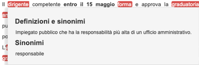

# SPRINT - Interactive Frint-End (IFE)


Insieme di librerie Javascritp che abilitano l'integrazione degli strumenti di semplificazione e di supporto all'interazione in un generrico sistema e/o in un servizio digitale.

# Descrizione

Il progetto SPRINT intende valorizzare alcuni risultati del progetto SIMPATICO (https://www.simpatico-project.eu/) volti a migliorare e semplificare l’interazione tra cittadino e servizi online. L’obiettivo del progetto è di creare un kit che permetta una facile integrazione di alcune funzioni avanzate di SIMPATICO in un generico portale della Pubblica Amministrazione e/o in un servizio online. 

L'Interactive Front-End (IFE), che fa parte della famiglia di tools messa in riuso, e' il componente che consente di integrare le fuzioni di adattamento del testo, di adattamento del workflow e di supporto alla misura della complessita' di un testo in un portale e/o in un servizio digitale terzi. Per fare questo utilizza i sotto componeni Wrokflow Adaptatione Engine (WAE), Text Adaptation Engine (TAE), Collaborative Procedure Designer (CPD) e Citizenpedia-Q&A (QAE). 

La descrizione completa e tecnica di utilizzo dei diversi componenti si trova nel documento [di progetto](doc/BP-OR-AP-06_v1.0.pdf)

## Workflow Adaptation Engine (WAE)

Il Workflow Adaptation Engine è responsabile di adattare e semplificare l’interazione con gli e-service. Una volta individuati i diversi blocchi interattivi dell’e-service, consente di modificarne e semplificarne il flusso di compilazione. Il WAE permette di: 
 1. suddividere l'e-service (template HTML) in blocchi di interazione e presentare gli stessi all'utente in base alle dipendenze tra essi ed allo stato della compilazione (vedi (1) in figura).
 1. presentare all'utente una sezione di suggerimenti vicino a ciascun blocco di interazione per fare capire meglio cosa inserire nei diversi campi (vedi (12) in figura).
 1. presentare all'utente una sezione dove vengono presentate le domande e risposte presenti nel modulo QAE relative al blocco selezionato (vedi (3) in figura).
 1. presentare all'utente una sezione che visualizza l’insieme dei blocchi interattivi da cui è composto il servizio online (vedi (4) in figura).

 

Per applicare la workflow adaptation ad un e-service occorre quindi marcare i blocchi interattivi all’interno del documento digitale e codificare le dipendenze tra gli stessi in un Workflow Adaptation Model. Quando attivato, il WAE recupera le informazioni dal Workflow Adaptation Model, estrae i vari blocchi interattivi e applica le regole di esecuzione/dipendenza.

## Text Adaptation Engine (TAE)

Il Text Adaptation Engine permette di adattare/modificare il testo per migliorarne leggibilità e comprensione. 

In particolare TAE permette di: 
 * dato una parola consente di arricchirla con informazioni atte a migliorarne la comprensione;

 

 * data una frase consente di rivederla nella forma per renderla più leggibile e comprensibile.

  

## Collaborative Process Designer (CPD)

Il CPD e' uno strumento che consente di creare rappresentazioni grafiche di procedure pubbliche sotto forma di diagrammi. Questi diagrammi possono rappresentare sia servizi elettronici che servizi non digitali che i cittadini devono utilizzare per raggiungere un obiettivo specifico.

 

In particolare il CPD permette di:
 * creare e modificare un diagramma del flusso di lavoro, utilizzando simboli simili a UML.
 * Social/collaborative: consente di pubblicare commenti sul diagramma.

## Citizenpeda-QAE

Si tratta di una particolare funzione di Citizenpedia che consente di pubblicare, classificare e risolvere domande da parte degli utilizzatori finali sugli e-services. Nello specifico le domande e risposte relative ad un servizio vengono presentate all’utente direttamente nella pagina del servizio tramite l’IFE. Il QAE è costituito da un'interfaccia web che abilita l'interazione con gli utenti (cittadini e dipendenti pubblici) da qualsiasi tipo di dispositivo, ad es. smartphone o PC. 
È definito il ruolo di moderatore. Il moderatore è responsabile della gestione e del mantenimento della qualità delle informazioni raccolte.

 

## Altri riferimenti

Per maggiori informazioni è possibile consultare:
 * documento [di progetto](dic/BP-OR-AP-06_v1.0.pdf)

## Product status

Il prodotto è stabile e production ready e usato in produzione dal Comune di Trento. Lo sviluppo avviene sia su richiesta degli Enti utilizzatori, sia su iniziativa autonoma del maintainer.

## Struttura del repository

Il repository è organizzato con una struttura di directory tipica dei progetti Javascript.
 * nella cartella js sono presenti le librerie Jasvascript sviluppate
 * nella cartella css sono presenti le librerie css sviluppate
 * nella cartella PILOT_TRENTO sono presenti degli esempi configurazioni ed utilizzo del sistema sviluppato per il Comune di Trento 
* Nella directory doc e' presente la documentazione del progetto SPRINT

## Copyright:

  license: MIT
  mainCopyrightOwner: 'Smart Community Lab, FBK and Comune di Trento'
  repoOwner: 'Smart Community Lab, FBK and Comune di Trento'

## Soggetti incaricati del mantenimento

  name: Marco Pistore
  email: pistore@fbk.eu
  affiliation: Fondazione Bruno Kessler

## Segnalazioni di sicurezza
Le segnalazioni di sicurezza vanno inviate all'indirizzo pistore@fbk.eu

## Prerequisiti e dipendenze

 * TAE nel caso si intenda utilizzarne le funzioni
 * WAE nel caso si intenda utilizzarne le funzioni
 * CPD nel caso si intenda utilizzarne le funzioni
 * Citizenpedia-QAE nel caso si intenda utilizzarne le funzioni
 * AAC nel caso si intenda abilitare l'autenticazione utente per l'accesso alle funzionalita' supportate


# Technical Documentation

The Interactive Front-End component (IFE) is the main component which dialogs with users meanwhile they are interacting with a Public Administration e-service. Several features of the platform could be selected and used through this component.
Features:
 - **Text Adaptation**: *Text simplification* of the paragraphs and of the text selected by the user and *terms definitions* 
 - **Workflow Adaptation**: simplification and guidance for the form compilation
 - **Question and Answers Engine**: ask and *get questions* related to the enhanced e-service
 - **Collaborative Process Design**: get a *diagram describing* the corresponding e-service
 - **Authoring Support Tool**: add support for the text analysis to the editors

IFE is a group of JavaScript libraries that runs in a web browser and enables to apply the enhancement features over the existing electronic services.

## Content
- [1. Usage](#1-usage)
- [2. Instrumenting E-service Web Page.](#2-instrumenting-e-service-web-page)
- [3. Configuring IFE Components](#3-configuring-ife-components)
- [4. Pilot Examples and Test Execution](#4-pilot-examples-and-test-execution)

## 1. Usage 
In order to use Interactive Front-End, JS Libraries should be loaded and configured in each enhanced webpage.
Depending of the features, different JS Libraries should be selected.

| File | Feature | Mandatory | Required Component | Description |
| :--- | :--- | :---: | :---: | :--- |
|  *simpatico-auth.js* | **Authentication**  | Yes | [AAC](https://github.com/SPRINT-Project/aac) |The Authentication and Authorization Control Module client connected to the **AAC** module |
| *ctz-ui.js* and *ctz-core.js* | **Questions and Diagrams**  | No | [Citizenpedia](https://github.com/SIMPATICOProject/citizenpedia)  | The Citizenpedia Component client which exposes questions related to the e-service, it enables users to ask new ones and search a diagram which represents the current e-service |
| *tae-ui.js* and *tae-core.js* / *tae-ui-popup.js* and *tae-core-popup.js* | **Text Adaptation**  | No | [TAE/WAE](https://github.com/SPRINT-Project/adaptation-engines)  | The Text Adaptation Engine Component client which exposes text simplifications and complex words definitions and synonyms to ease the e-service understanding  |
| *wae-ui.js* and *wae-core.js* | **Workflow Adaptation**  | No | [TAE/WAE](https://github.com/SPRINT-Project/adaptation-engines)  | The Workflow Adaptation Engine Component client which exposes the workflow simplification and adaptation functionality  |

The integration and configuration of these components is specific to the deployment environment. Basic setup 
consists of instrumenting a toolbar, where the access to the instruments is 
granted to the authenticated users. See the pilot-specific examples on how the tools and toolbars
are constructed. These examples configure the components and toolbars via ``simpatico-ife.js`` script.

In order to integrate IFE into a e-service Web page, the following steps should be performed:
- install and configure the platform components required by IFE (see the table above);
- instrument the e-service Web page with the scripts/style files in order to enable and configure the toolbar;
- configure the modules used bt the toolbar: AUTH, TAE, WAE, Citizenpedia.

## 2. Instrumenting E-service Web Page.

### Injection of JS Libraries
TO enable toolbar for a specific e-service, the Web page of the e-service should include the reference 
to the JavaScript libraries according to the table defined above. For example: 

```html
    <script src="js/ctz-ui.js"></script>
    <script src="js/ctz-core.js"></script>
    <script src="js/tae-core.js"></script>
    <script src="js/tae-ui.js"></script>
    <script src="js/wae-core.js"></script>
    <script src="js/wae-ui.js"></script>

    <script src="js/tae-core-popup.js"></script>
    <script src="js/tae-ui-popup.js"></script>

    <script src="js/simpatico-auth.js"></script>

    <script src="js/simpatico-ife.js"></script>
```

Additionally, it is possible to include and customize the CSS styles for the Simpatico toolbar and its instruments:

```html
    <link rel="stylesheet" href="css/simpatico.css"/>
```

### Global variables

The tools rely on a set of globally available variables that defines properties specific to the current e-service Web page.
These properties include:

* **simpaticoEservice** (required): It contains the unique id of the enhanced e-service.
* **simpaticoForm** (optional): It contains the unique identifier of the form of a e-service that the user is expected to fill in on the current
page. If the page does not contain the form, the variable should be omitted. The value is used to log FORM START event upon the page initialization.
* **simpaticoCategory** (optional): It contains the general category of the enhanced e-service. It is used by the Citizenpedia client.
Example:
```html
  <script type="text/javascript">
    var simpaticoEservice = "BS607A"; //  the id corresponding to the e-service
    var simpaticoForm = "main";
    var simpaticoCategory = "Wellness"; // the general category of the e-service
  </script>
```

### Customize Toolbar

The toolbar, its appearance and functionality is defined in *simpatico-ife.js* JavaScript. This script configures individual modules, 
defines the toolbar itself, and defines the behavior of the toolbar buttons.  To change the default behavior, it is possible to
change this script. In particular, it is possible to define which components should be activated, how the toolbar appears, etc.

## 3. Configuring IFE Components

The configuration of IFE modules is performed within the [simpatico-ife.js](https://github.com/SPRINT-Project/IFE/blob/master/js/simpatico-ife.js) file.

### Configure Authentication

The AAC module should be already installed and available over Internet. It is also necessary to configure the OAuth2.0 client
with the implicit (browser) flow enabled and redirect URI defined.

To configure AAC in IFE it is necessary to define the properties of the authManager module:

```JavaScript
  authManager.getInstance().init({
    endpoint: 'https://the-aac-instance-endpoint.com', 
    clientID: 'A0A0A0A0-A0A0-A0A0-A0A0-A0A0A0A0A0A0',
    authority: "google",
    redirect: 'https://my-callback-endpoint.com/',
    greeting: 'ACCESS TOOLS'
  });
```
Parameters:
* **endpoint**: the main URL of the used AAC instance.
* **clientID**: the IFE Client ID registered in the AAC instance
* **authority**: the used authentication mechanism. If not specified, the authority (authorities) will be taken from the AAC client configuration.
* **redirect**: (optional, defaults to /IFE/login.html) the page to which AAC redirects upon successful integration. Please note that IFE expects 
the redirect page to contain the scripts which communicates the OAuth2.0 token information upon success. See [login.html](https://github.com/SPRINT-Project/IFE/blob/master/login.html)
page for details.
* **greeting**: a string to invite the user to signin.

**IMPORTANT!** For the Authentication to work correctly under IE 10/11, it is necessary that the redirect page is **IN THE SAME DOMAIN** the e-service page is. The
code of the redirect page should reflect the one found in [login.html](https://github.com/SPRINT-Project/IFE/blob/master/login.html). 

### Configure Question and Answer Module (Citizenpedia)

The citizenpedia IFE module requires the citizenpedia component already installed and made available over Internet.

To configure the Citizenpedia component it is necessary to setup the citizenpediaUI module:
```JavaScript
  citizenpediaUI.getInstance().init({
    endpoint: 'https://the-citizenpedia-instance-endpoint.com'
    cpdDiagramEndpoint: 'https://the-cpd-instance-endpoint.com/cpd/api/diagram/eService',
    primaryColor: "#24BCDA",
    secondaryColor:"#D3F2F8",
    elementsToEnhanceClassName: "simp-text-paragraph",
    questionsBoxClassName: "simp-ctz-ui-qb",
    questionsBoxTitle: "RELATED QUESTIONS",
    addQuestionLabel: "+ Add new question",
    diagramNotificationImage: "./img/diagram.png",
    diagramNotificationClassName: "simp-ctz-ui-diagram",
    diagramNotificationText: "There is one diagram related to this e-service in Citizenpedia",
    questionSelectionFilters: ['h1', '.h2']
  });
```
Parameters:
* **endpoint**: the main URL of the used Citizenpedia instance
* **cpdDiagramEndpont**: the endpoint of the
CPD API service with the diagram eService data. Normally refers to the CPD endpoint with the context path ``/cpd/api/diagram/eService``.
* **primaryColor**: color used to highlight the enhanced components
* **secondaryColor**: color used to paint the question boxes backgrounds
* **elementsToEnhanceClassName**: the CSS class used to define the enhanced elements
* **questionsBoxClassName**: the CSS class of the box which shows questions
* **questionsBoxTitle**: title of the box which shows questions
* **addQuestionLabel**: text exposed to show the action to create a question
* **diagramNotificationImage**: Image to show when a diagram is found
* **diagramNotificationClassName**: The CSS class of the img shown when a diagram is found
* **diagramNotificationText**: The text to notify that a diagram
* **questionSelectionFilters**: optional jQuery selectors used by QAE library to extract the data for the question. That is if the HTML block annotated with the ``questionsBoxClassName`` class contains a lot of sub-elements, it is possible to restrict only to those that match the specified selectors.

### Configure Text Adaptation Engine Module

The TAE IFE module requires the TAE/WAE component already installed and made available over Internet.

TAE module come with the UI in two flavours, for the simplification of pre-annotated paragraph/phrases and for
the simplification of the text/words directly selected by the user (popup mode).

To configure the TAE component it is necessary to setup the taeUI, taeUIPopup, or taeUIInline modules:

```JavaScript
  taeUI.getInstance().init({
    endpoint: 'https://the-tae-instance-endpoint.com/simp-engines/tae',
    language: 'it',
    primaryColor: "#DE453E",
    secondaryColor:"#F0ABA8",
    elementsToEnhanceClassName: "simp-text-paragraph",
    simplifyBoxClassName: "simp-tae-ui-sb",
    simplifyBoxTitle: "Simplified text",
    wordPropertiesClassName: "simp-tae-ui-word",
    synonymLabel: "Synonyms",
    definitionLabel: 'Definitions',
  	emptyText: 'No simplifications found for this text'
  });
```
Parameters:
* **endpoint**: the main URL of the used TAE instance
* **language**: the language of the text to be adapted by the TAE instance
* **primaryColor**: Color used to highlight the enhanced components
* **secondaryColor**: Color used to paint the simplification boxes backgrounds
* **elementsToEnhanceClassName**: The CSS class used to define the enhanced elements
* **simplifyBoxClassName**: The CSS class of the box which shows the simplifications
* **simplifyBoxTitle**: Title of the box which shows the simplifications
* **wordPropertiesClassName**: The CSS class of the word properties box
* **synonymLabel**: label for 'synonyms' block
* **definitionLabel**: label for 'definitions' block
* **emptyText**: text to show in case of no simplifications provided.  

```JavaScript
  taeUIPopup.getInstance().init({
		lang: 'it',
		endpoint: 'https://the-tae-instance-endpoint.com/simp-engines/tae',
		dialogTitle: 'Text enrichment',
		tabDefinitionsTitle: 'Definitions',
		tabSimplificationTitle: 'Simplifications',
		tabWikipediaTitle: 'Wikipedia',
		entryMessage: 'Select a tool',
		notextMessage: 'No text selected'
	});
```
Parameters:
* **endpoint**: the main URL of the used TAE instance
* **lang**: the language of the text to be adapted by the TAE instance
* **dialogTitle**: title of the popup dialog
* **tabDefinitionsTitle**: title of the Definitions tab of the popup dialog
* **tabSimplificationTitle**: title of the Simplification tab of the popup dialog
* **tabWikipediaTitle**: title of the Wikipedia tab of the popup dialog
* **entryMessage**: text for the initial tooltip in the dialog
* **notextMessage**: text for the tooltip in case no text selected


```JavaScript
  taeUIInline.getInstance().init({
		lang: 'it',
		endpoint: 'https://the-tae-instance-endpoint.com/simp-engines/tae',
    textContainerQuery: "block-stu3-italia-content",
    textQueryString: "p,li",
    elementId: 'simp-bar-sw-tae-inline',
    synonimLabel:'Sinonimi',
    definitionLabel: 'Definizione',
    simplifedTextLabel: 'Testo semplificato'
	});
```
Parameters:
* **endpoint**: the main URL of the used TAE instance
* **lang**: the language of the text to be adapted by the TAE instance
* **textContainerQuery**: container element for the whole text to be processed
* **textQueryString**: text elements to be processed within the container
* **elementId**: reference to the element of the page to which the TAE control will be associated
* **synonimLabel**: Label for the synonims content
* **definitionLabel**: Label for the definitions content
* **simplifedTextLabel**: Label for the simplified phrase content


### Configure Workflow Adaptation Engine Module

The WAE IFE module requires the TAE/WAE component already installed and made available over Internet.

To configure the WAE component it is necessary to setup waeUI module:
```JavaScript
  waeUI.getInstance().init({
		lang: 'en',
		endpoint: 'https://he-wae-instance-endpoint.com/simp-engines/wae',
		prevButtonLabel: 'Previous',
		nextButtonLabel: 'Next',
		lastButtonLabel: 'Done',
		descriptionLabel: 'Description',
		topBarHeight: 60,
		errorLabel: {
      'block1' : 'Phone number is required'
    }
  });
```
Parameters:
* **lang**: the language of the text to be adapted by the WAE instance
* **endpoint**: the main URL of the used WAE instance
* **prevButtonLabel**: Label for 'previous step' button
* **nextButtonLabel**: Label for 'next step' button
* **lastButtonLabel**: Label for 'last step' button
* **descriptionLabel**: Label for 'description' block header
* **topBarHeight**: height of the bar to control the scroll
* **errorLabel**:  error messages for the adapted workflow blocks, if available on the page.

Please note that the module requires that the corresponding workflow has been uploaded to the WAE repository. The example of the
workflow model for the [form.html](https://github.com/SPRINT-Project/IFE/blob/master/PILOT_TRENTO/form.html) page can be found in 
[waemodel.json](https://github.com/SPRINT-Project/IFE/blob/master/PILOT_TRENTO/data/waemodel.json). To upload the model to the repository
it is necessary to use the API method ``addModelStoreUsingPOST``.

The URI of the workflow model is configured directly in the page as an **data-simpatico-workflow** attribute of the enclosing HTML tag, e.g.,
```HTML
<form data-simpatico-workflow="indexdemo" ...>
...
</form>
```

**IMPORTANT!** WAE library relies on the XPath API of the browser, which is not available on IE 10/11. To make it work, the following JS and code
should be included in the page together with the other JavaScript dependencies:

```HTML
    <script src="https://github.com/google/wicked-good-xpath/releases/download/1.3.0/wgxpath.install.js"></script>
    <script>
        wgxpath.install();
    </script>
```
### Buttons configuration

In order to personalise the look and feel of each feature button, the parameters of each one should be defined.

* **id**: the unique element id used to get the button inside the DOM
* **imageSrcEnabled**: the URL of the image shown when the button is enabled
* **imageSrcDisabled**: the URL of the image shown when the button is disabled
* **alt**: the alternative text of the button
* **styleClassEnabled**: the CSS class applied to the button shown when it is enabled
* **styleClassDisabled**: the CSS class applied to the button shown when it is disnabled,
* **isEnabled**: function that should return true if the corresponding component is currently activated
* **enable**: activate the component
* **disable**: de-activate the component:
* **text**: Label for the button

Example of the buttons configuration:
```JavaScript
  buttons = [{
                  id: "simp-bar-sw-login",
                  // Ad-hoc images to define the enabled/disabled images
                  imageSrcEnabled: "./img/ic_on.png",
                  imageSrcDisabled: "./img/login.png",
                  alt: "Autheticate",
                  // Ad-hoc css classes to define the enabled/disabled styles
                  styleClassEnabled: "simp-none", 
                  styleClassDisabled: "simp-none",
                  
                  isEnabled: function() { return authManager.getInstance().isEnabled(); },
                  enable: function() { authManager.getInstance().enable(); },
                  disable: function() { authManager.getInstance().disable(); },
                  text: 'Sign In'
                },

                {
                  id: "simp-bar-sw-citizenpedia",
                  // Ad-hoc images to define the enabled/disabled images
                  imageSrcEnabled: "./img/citizenpedia.png",
                  imageSrcDisabled: "./img/citizenpedia.png",
                  alt: "Questions and answer",
                  // Ad-hoc css classes to define the enabled/disabled styles
                  styleClassEnabled: "simp-bar-btn-active",
                  styleClassDisabled: "simp-bar-btn-inactive",

                  isEnabled: function() { return citizenpediaUI.getInstance().isEnabled(); },
                  enable: function() { citizenpediaUI.getInstance().enable(); },
                  disable: function() { citizenpediaUI.getInstance().disable(); },
                  text: "Questions and Answers"
                },
                {
                  id: "simp-bar-sw-tae",
                  // Ad-hoc images to define the enabled/disabled images
                  imageSrcEnabled: "./img/simplify.png",
                  imageSrcDisabled: "./img/simplify.png",
                  alt: "Text simplification",
                  // Ad-hoc css classes to define the enabled/disabled styles
                  styleClassEnabled: "simp-bar-btn-active-tae",
                  styleClassDisabled: "simp-bar-btn-inactive-tae",

                  isEnabled: function() { return taeUI.getInstance().isEnabled(); },
                  enable: function() { taeUI.getInstance().enable(); },
                  disable: function() { taeUI.getInstance().disable(); }
                },
                text: "Simplify"
                {
                    id: "simp-bar-sw-tae-popup",
                    // Ad-hoc images to define the enabled/disabled images
                    imageSrcEnabled: "./img/enrich.png",
                    imageSrcDisabled: "./img/enrich.png",
                    alt: "Semplificazione del testo selezionato",
                    // Ad-hoc css classes to define the enabled/disabled styles
                    styleClassEnabled: "simp-bar-btn-active-tae",
                    styleClassDisabled: "simp-bar-btn-inactive-tae",

                    isEnabled: function() { return taeUIPopup.getInstance().isEnabled(); },
                    enable: function() { 
                    	taeUIPopup.getInstance().showDialog(); 
                    },
                    disable: function() { 
                    	taeUIPopup.getInstance().hideDialog(); 
                    },
                    text: "Simplify (Popup)"
                },
                { // workflow adaptation. Switch to the modality, where the form adaptation starts
                  id: 'workflow',
                  imageSrcEnabled: "./img/forms.png",
                  imageSrcDisabled: "./img/forms.png",
                  alt: "Semplifica processo",
                  // Ad-hoc css classes to define the enabled/disabled styles
                  styleClassEnabled: "simp-bar-btn-active-wae",
                  styleClassDisabled: "simp-bar-btn-inactive",

                  isEnabled: function() { return waeUI.getInstance().isEnabled(); },
                  enable: function() { var idProfile = null; waeUI.getInstance().enable(idProfile); },
                  disable: function() { waeUI.getInstance().disable(); },
                  text: "Step by step compilation"
                }
            ];
```
## 4. Pilot Examples and Test Execution

The example e-service pages with IFE configurations may be found in ``PILOT_TRENTO`` subfolder. To run the demos locally, the following steps should be performed:

1. Install the local server dependencies (from the root directory of the project):
```
  npm install
```
2. Run the local server 
```
  npm start
```
3. Open the demo page served at ``http://localhost:10001/``, for example: ``http://localhost:10001/PILOT_TRENTO/form.html``

Please note that some of the demo functionalities may fail due to CORS restrictions with respect to localhost domain.
